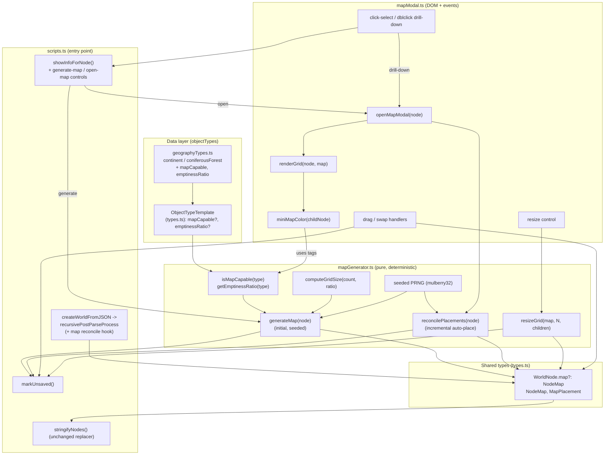

# Design Document

## Overview

Node Maps adds an optional 2D spatial layout to selected geographical `WorldNode` types. A map is a square `N x N` discrete tile grid laid over a node's children. Every tile resolves to one of three kinds — a **Child_Tile** (a single Point_Of_Interest child), a **Terrain_Tile** (generic biome fill), or a **Void_Tile** (square-completion padding). Maps are generated on demand exactly once, then hand-edited (drag-to-reposition, swap, manual grid resize, incremental auto-placement of newly added children). All layout randomness derives from a persisted integer **layout seed** so the arrangement is deterministic and stable across reopens and save/load.

The feature is built to honor two hard constraints from the requirements and the project's steering philosophy:

1. **Backward-compatible serialization.** A node without a map must serialize byte-for-byte as it did before this feature existed. The map is an *optional* field (`map?: NodeMap`) on `WorldNode`; map-capability is resolved *solely* from `ObjectTypeTemplate` metadata, so no `WorldNode` change is needed when a new type opts in (Req 1.4, 5.2).
2. **Data defines what exists, code defines what makes sense.** Map-capability and emptiness are declared as new optional *template metadata* on `ObjectTypeTemplate` (in `objectTypes`), while the generation intelligence (N-sizing, seeded clustered-vs-spread placement, incremental placement, resize safety) lives in code. This mirrors the existing `tags` / `customSetup` / dynamic-creature split.

Rendering reuses the project's existing modal precedent (`#statblock-modal`): a *single* reusable `#map-modal` whose content is swapped during drill-down navigation. Map-capable children embedded on a parent map render as flat terrain-colored tiles (a Mini_Map), never a nested grid.

The initial release enables maps for two geography types defined in `geographyTypes.ts`:

- `continent` — `mapCapable: true`, `emptinessRatio: 0` (continent-like: between-children space is all Void).
- `coniferousForest` (the "taiga") — `mapCapable: true`, high `emptinessRatio` (taiga-like: generic terrain fills between children).

### Research Notes (grounding in the existing codebase)

- **Serialization is a single `JSON.stringify` replacer** in `stringifyNodes(node, excludeGmOnly)` that drops `domElement` and `parent` keys and filters GM-only children. Because the replacer is key-based (not type-based), any `NodeMap` object graph that contains *no* `parent`/`domElement` keys serializes cleanly with no replacer change (Req 5.5). This is why the `NodeMap` must store child references as stable **data** (ids/indices), never live `WorldNode` pointers.
- **Load path** is `createWorldFromJSON(json)` → `JSON.parse` → `recursivePostParseProcess(node)` (re-links `parent`, strips stale `"undefined"` attribute keys) → DOM build → `showInfoForNode(root)`. Map reconciliation (resolving stable child references, pruning placements for missing children) hooks into `recursivePostParseProcess` and/or lazily at modal-open time.
- **`markUnsaved()`** debounces an auto-save to `localStorage['currentWorld']`. Every map mutation (generation, edit, resize, incremental placement) calls it (Req 2.5, 8.5, 9.7, 10.11).
- **Info panel** `showInfoForNode(node)` renders `#info-panel #fields` and appends a `.button-view-statblock` for creature nodes via a delegated `$('body').on('click', ...)` handler. The map controls follow this exact pattern: appended to `#fields`, wired via delegated handlers.
- **Modal precedent** `#statblock-modal` opens by adding `.is-open`, closes via `#statblock-modal-close` and a backdrop handler that checks `e.target === this`. `#map-modal` mirrors this exactly.
- **RNG helpers** (`rand`, `randFromArray`, `weightedRand`) all call `Math.random()` directly and are therefore **not seedable**. The map generator needs reproducibility from a stored seed, so it introduces a small seeded PRNG (see Architecture → Seeded PRNG decision) used *only* for layout derivation.
- **`collectAncestorTags(node, typeMap)`** already walks the parent chain gathering template `tags`. The Mini_Map terrain-color derivation reuses the per-type `tags` vocabulary (`water`, `forest`, `cold`, `plains`, `desert`, etc.) to pick a color.

## Architecture

The feature is organized into a small set of modules consistent with the project layout (new modules under `src/scripts/`, metadata in `objectTypes`, pure helpers in `helpers.ts`). The generator is pure/deterministic and side-effect free; all DOM, event, and persistence wiring lives in the modal/UI layer and the `scripts.ts` entry point.



### Data flow

- **Generate (Req 2):** info panel "Generate Map" → `generateMap(node)` builds a `NodeMap` from the node's current POI children using a freshly chosen seed → attaches `node.map` → `markUnsaved()` → swap the control to "Open Map".
- **Open (Req 6, 8):** info panel "Open Map" (or drill-down) → `reconcilePlacements(node)` auto-places unplaced children / frees removed-child tiles → `openMapModal(node)` renders the grid into the single `#map-modal`.
- **Edit (Req 9, 10, 11):** pointer handlers mutate `node.map.placements` (reposition/swap/resize) in place and re-render → `markUnsaved()`.
- **Save (Req 5):** `stringifyNodes` serializes `node.map` as plain data via the existing replacer.
- **Load (Req 4, 5):** `createWorldFromJSON` → `recursivePostParseProcess` re-links parents; map placements are reconciled against current children lazily (at modal open) and defensively at render time.

### Seeded PRNG decision

The requirements demand a deterministic, persisted layout derived from a seed (Req 3.8, 4.2, 4.3, 4.5). The existing helpers use `Math.random()` and cannot be seeded. **Decision: introduce a small, dependency-free seeded PRNG (`mulberry32`) in `helpers.ts`**, used *exclusively* by `mapGenerator.ts` for (a) deriving tile coordinates and (b) the single clustered-vs-spread boolean choice.

Rationale:

- `mulberry32` is ~5 lines, deterministic, well-distributed for layout purposes, and needs only a 32-bit integer seed — trivially JSON-serializable as `layoutSeed: number` (Req 4.3). No new dependency, consistent with the project's "no framework / vanilla" stance.
- It is kept separate from `rand`/`weightedRand` (which stay on `Math.random()` for all non-layout generation) so existing world-gen behavior is untouched.
- Reproducibility: `mulberry32(seed)` returns a generator; feeding the same seed yields the identical stream, so re-deriving coordinates for the same child set yields identical `(column, row)` and the identical cluster/spread choice (Req 4.2).
- The seed is generated once at map creation with `Math.floor(Math.random() * 2**32)` and then *persisted and never regenerated* (Req 2 "once", Req 4.5). Incremental auto-placement re-seeds a sub-stream deterministically from `layoutSeed` plus a stable offset (e.g. the count of already-placed children) so later placements are reproducible without disturbing existing ones.

## Components and Interfaces

### 1. Shared types (`src/scripts/types.ts`)

New optional template metadata on `ObjectTypeTemplate` and a new optional `map` field on `WorldNode`.

```typescript
export interface ObjectTypeTemplate {
  // ...existing fields...

  /**
   * When true, nodes of this type may carry a Node_Map (a 2D tile-grid layout of
   * their children). Resolved solely from the template — adding map support to a
   * type requires NO change to the WorldNode data structure. (Req 1.1, 1.4)
   */
  mapCapable?: boolean;

  /**
   * Ratio of generic empty space (Terrain_Tiles) to child Points_Of_Interest for a
   * map-capable type. 0 = continent-like (no terrain between children; non-child
   * tiles are square-completion Void only). > 0 = taiga-like (generic terrain fills
   * between children). Defaults to 0 when absent. (Req 1.5, 1.6, 3.6)
   */
  emptinessRatio?: number;
}

export interface WorldNode {
  // ...existing fields...

  /**
   * Optional 2D spatial layout of this node's children. Absent on nodes without a
   * map; absent nodes serialize byte-for-byte as before map support existed.
   * Contains NO live parent/domElement references — children are referenced by a
   * stable id string. (Req 1.3, 5.1, 5.2, 5.5)
   */
  map?: NodeMap;
}

/**
 * Structured layout data attached to a WorldNode. Pure data — safe to JSON.stringify
 * with the existing replacer (no parent/domElement keys).
 */
export interface NodeMap {
  /** Current grid side length N (tiles per side). Derived or manually set. (Req 3.4) */
  gridSize: number;

  /**
   * User-set side length floor. Absent until the user manually resizes. Automatic
   * sizing never reduces gridSize below this; incremental placement may grow beyond.
   * (Req 10.2, 10.6, 10.8)
   */
  manualGridSize?: number;

  /**
   * Integer seed from which all layout randomness derives. Persists through save/load.
   * (Req 4.3) If absent/unrecoverable on load, recorded placement coords are used as-is. (Req 4.6)
   */
  layoutSeed: number;

  /** One entry per placed child Point_Of_Interest. (Req 3.1) */
  placements: MapPlacement[];
}

/**
 * Where a single child node sits on the grid. Tile kinds (Child/Terrain/Void) are
 * NOT stored — they are derived at render time (see Data Models). Only child
 * placements are persisted.
 */
export interface MapPlacement {
  /**
   * Stable reference to the represented child node that survives save/load and
   * remains resolvable while the child exists. (Req 3.9, 5.6) See "Stable child
   * reference" in Data Models.
   */
  childRef: string;

  /** Integer tile coordinate, 0..N-1 inclusive. (Req 3.2) */
  col: number;
  row: number;

  /**
   * True when the tile was set by a manual Map_Edit (drag/swap). A user-positioned
   * placement's recorded tile is authoritative over any seed-derived tile. (Req 4.7, 9.4)
   */
  userPositioned?: boolean;
}
```

### 2. Map generator (`src/scripts/mapGenerator.ts`) — new, pure/deterministic

Holds a forward reference to `objectTypes` (via a `setObjectTypesRef`-style wiring, as `attributeGenerators.ts` already does) to avoid a circular import.

```typescript
/** Map-capability + emptiness resolvers (Req 1.1, 1.5, 1.6). */
export function isMapCapable(type: string): boolean;
export function getEmptinessRatio(type: string): number; // defaults to 0

/**
 * Smallest integer N such that N*N >= poiCount AND the resulting void count
 * (N*N - poiCount) satisfies the emptiness ratio. Deterministic in (count, ratio).
 * (Req 3.4, 3.6, 4.8)
 */
export function computeGridSize(poiCount: number, emptinessRatio: number): number;

/**
 * Build a fresh NodeMap from a node's current POI children using a new random seed.
 * One placement per POI child, unique tiles, seeded clustered-vs-spread layout.
 * (Req 2.2, 2.7, 3.1-3.9, 4.2)
 */
export function generateMap(node: WorldNode): NodeMap;

/**
 * Incremental reconciliation performed at modal open:
 *  - free tiles whose placements reference missing children (into empty pool),
 *  - auto-place each Unplaced_Child onto an empty tile (growing N if needed,
 *    never below max(current N, manualGridSize)),
 *  - leave every existing placement (incl. userPositioned) untouched.
 * Returns true if the map changed (caller then markUnsaved()). (Req 8.1-8.6, 10.9)
 */
export function reconcilePlacements(node: WorldNode): boolean;

/**
 * Manual resize. Enlarge: add cells at the high-index edge. Shrink: peel outer
 * row/col (index N-1); REFUSE if a child occupies the removed area, enforce the
 * all-children floor. Returns a discriminated result for the UI. (Req 10.1-10.8)
 */
export function resizeGrid(
  map: NodeMap, requestedN: number, node: WorldNode
): { ok: true } | { ok: false; reason: 'occupied' | 'belowFloor'; floor: number };

/** Smallest N holding all current child placements (resize floor). (Req 10.7) */
export function minGridSizeFor(placementCount: number): number;

/** Resolve the live child WorldNode for a placement, or undefined if gone. (Req 5.6, 8.7) */
export function resolvePlacementChild(node: WorldNode, p: MapPlacement): WorldNode | undefined;
```

### 3. Seeded PRNG (`src/scripts/helpers.ts`) — new helper

```typescript
/** Deterministic 32-bit seeded PRNG. Returns a function yielding floats in [0,1).
 *  Used ONLY by mapGenerator for layout derivation; general gen keeps Math.random(). */
export function mulberry32(seed: number): () => number;
```

### 4. Map modal / rendering (`src/scripts/mapModal.ts`) — new, DOM + events

```typescript
/** Open (or drill into) the single #map-modal for a node that has a map.
 *  Runs reconcilePlacements first, renders the grid, wires interactions. (Req 6.2, 8.1, 11.8) */
export function openMapModal(node: WorldNode): void;

/** Render the N x N grid (CSS grid) into the modal body. Derives tile kinds,
 *  draws POIs, Mini_Maps, labels, visual tile distinction. (Req 6.3, 6.4, 6.7, 7.*) */
function renderGrid(node: WorldNode): void;

/** Representative terrain color for a child, from its type tags/metadata, with
 *  a default fallback. (Req 7.1, 7.4) */
export function miniMapColor(childNode: WorldNode): string;
```

The modal markup is added to `src/pages/index.pug` mirroring `#statblock-modal`:

```pug
#map-modal
  .map-modal-content
    button#map-modal-close ✕
    .map-modal-toolbar
      label(for="map-grid-size") Grid size:
      input#map-grid-size(type="number" min="1")
    #map-modal-body
```

### 5. Host wiring (`src/scripts/scripts.ts`)

- In `showInfoForNode(node)`, after existing fields: if `isMapCapable(node.type)` and `!node.map`, append a `.button-generate-map`; if `node.map`, append a `.button-open-map` (Req 1.3, 2.1, 2.3, 6.1).
- Delegated handlers (mirroring `.button-view-statblock`): generate → `generateMap`, attach, `markUnsaved()`, re-render info panel so the open control appears (Req 2.5, 2.6); open → `openMapModal`.
- `#map-modal-close` click and backdrop click (`e.target === this`) close the modal (Req 6.5, 6.6).
- `recursivePostParseProcess` gains a defensive map hook (coordinate clamping / no throw); authoritative reconciliation happens at modal open.
- The info-panel change handler already skips elements without `id` / with class `add-child-select`; the resize `input#map-grid-size` lives in the modal, not `#fields`, so it does not interfere.

## Data Models

### NodeMap persisted shape (example)

```jsonc
{
  "type": "continent",
  "name": "Faerûn",
  "attributes": { "temperature": "Temperate" },
  "children": [ /* ...WorldNodes... */ ],
  "map": {
    "gridSize": 4,
    "manualGridSize": 4,
    "layoutSeed": 2894771002,
    "placements": [
      { "childRef": "c0", "col": 1, "row": 0 },
      { "childRef": "c1", "col": 2, "row": 2, "userPositioned": true }
    ]
  }
}
```

A node with no map simply has no `"map"` key — identical to a pre-feature save (Req 5.2).

### Stored vs. derived tiles — justification

Tile *kinds* are **derived at render time**, not stored:

- A cell `(col,row)` is a **Child_Tile** iff some placement has that coordinate.
- Otherwise it is a **Terrain_Tile** if the type's emptiness ratio > 0, else a **Void_Tile** (Req 3.5, 3.7).

Only `MapPlacement`s (child coordinates) are persisted. This is deliberate:

- **Smaller, future-proof payloads.** Storing every one of `N²` tiles would bloat saves and duplicate information already implied by `placements` + `emptinessRatio` + `gridSize`.
- **Single source of truth.** Emptiness ratio is per-type template metadata (code-owned). Deriving terrain/void from it means a type's ratio can evolve without migrating stored tiles.
- **Freed-tile semantics fall out naturally.** When a child is removed, its placement is dropped and the cell automatically re-derives as empty (Terrain/Void) — exactly the "freed tiles become void/empty" requirement (Req 8.1a, 8.7, 10.3) with no bookkeeping.

The derived-tile model satisfies Req 3.7 (every cell is Child/Terrain/Void) and Req 6.4 (render the three kinds visually distinct) at render time.

### Stable child reference (`childRef`) — scheme and trade-offs

Children have **no stable id field today** (Req 3.9, 5.6 require a reference that survives save/load and resolves while the child exists). Two candidate schemes were considered:

| Scheme | How it resolves | Pros | Cons |
| --- | --- | --- | --- |
| **A. Child array index** (`"c2"` = `children[2]`) | positional | zero new node fields; trivially serializable | breaks when children are reordered/removed (indices shift → placements point at the wrong child) |
| **B. Generated placement id** persisted on the child | a short id (e.g. `mapId`) written onto the child node once, matched by value | survives reordering, insertion, removal; unambiguous | adds a field to the referenced child node |

**Decision: Scheme B — a generated string id, but stored on the *placement's resolution map*, not forced onto every node.** Concretely:

- When a placement is first created for a child, generate a short unique id (e.g. `crypto.randomUUID()` slice, or a counter + seed) and store it as `MapPlacement.childRef`. Write the same id onto the child node under a dedicated, serialization-safe key `node.mapRef` **only for children that are actually placed** (so unplaced nodes and non-map worlds are untouched — preserving Req 5.2 byte-for-byte for maps-free saves; a node only gains `mapRef` once its parent has a map that places it).
- `resolvePlacementChild(node, p)` matches `p.childRef` against `child.mapRef` among `node.children`. Missing → placement is unresolved (rendered as freed tile, Req 5.6, 8.7).

Trade-off rationale: Scheme A's index fragility directly violates Req 3.9 ("remains resolvable to that child") under the project's existing reorder/move/delete operations (`markUnsaved` is called after node moves). Scheme B costs one small optional string on *placed* children only, is reorder/insertion/deletion-proof, and keeps non-map nodes pristine. `mapRef` is a plain string, so the existing `JSON.stringify` replacer serializes it with no change (Req 5.5), and `recursivePostParseProcess` needs no special handling for it.

> Note: `mapRef` is added to `WorldNode` as another optional field. This does **not** violate Req 1.4 (which forbids changing `WorldNode` *when a new type opts into map-capability*). `mapRef`/`map` are the one-time structural additions that *enable* the feature; after that, additional types opt in purely through template metadata with no further `WorldNode` change.

### Grid-size (N) formula

`computeGridSize(poiCount, ratio)` returns the smallest integer `N` satisfying both:

1. `N² ≥ poiCount` (every POI gets a unique tile), and
2. the void/empty budget `N² − poiCount` meets the emptiness requirement.

For ratio `r` (empty-to-children), the required empty count is `requiredEmpty = ceil(r * poiCount)`. So:

```
N = smallest integer with  N² ≥ poiCount + requiredEmpty
  = ceil( sqrt( poiCount + ceil(r * poiCount) ) )
```

- `poiCount = 0` → `N = 0`? No — a zero-children map represents only the node's own area, so `N` is floored at 1 (one tile, Terrain if r>0 else Void) (Req 2.7). Edge handling lives in Error Handling.
- ratio 0 → `requiredEmpty = 0` → `N = ceil(sqrt(poiCount))`: non-child tiles are purely square-completion Void (Req 3.5).
- ratio > 0 → `N` grows until the empty budget is met, and empties render as the type's generic terrain (Req 3.6).
- Deterministic in `(poiCount, ratio)` → same inputs always yield same N (Req 4.8). Final N is `max(computed, manualGridSize ?? 0, current gridSize)` during incremental placement (never auto-shrinks) (Req 8.2).

### Clustered-vs-spread placement algorithm (seeded)

Given `prng = mulberry32(layoutSeed)`:

1. Draw one boolean `clustered = prng() < 0.5` — the single per-map cluster/spread choice (Req 3.8). Persisted implicitly via the seed (same seed → same choice, Req 4.2).
2. Build the list of all `N²` cell coordinates.
3. **Spread:** shuffle all cells with a seeded Fisher–Yates (using `prng`) and assign POIs to the first `poiCount` cells — children scatter across the grid.
   **Clustered:** pick a seeded anchor cell, sort cells by distance from the anchor (ties broken by a seeded key), assign POIs to the nearest `poiCount` cells — children bunch together.
4. Each POI gets exactly one coordinate; no coordinate is reused (Req 3.3).

Because every random draw comes from the single seeded stream in a fixed order, re-running with the same seed and same child set reproduces identical coordinates and the identical cluster/spread choice (Req 4.2, 4.5). Incremental placement for later children uses a derived sub-seed (`layoutSeed` combined with the already-placed count) and only ever consumes currently-empty cells, leaving prior placements byte-identical (Req 8.3, 8.4).

## Correctness Properties

*A property is a characteristic or behavior that should hold true across all valid executions of a system — essentially, a formal statement about what the system should do. Properties serve as the bridge between human-readable specifications and machine-verifiable correctness guarantees.*

The following properties were derived from the acceptance-criteria prework and consolidated to remove redundancy (e.g. all round-trip criteria fold into one NodeMap round-trip; determinism criteria fold into one seeded-layout property; uniqueness after generate and after incremental placement share one no-overlap property). UI-gating, modal-lifecycle, drill-down navigation, visual tile distinction, and side-effect (`markUnsaved`) criteria are covered by example/DOM/integration tests in the Testing Strategy rather than as properties.

### Property 1: Map-capability resolves solely from template metadata

*For any* node type key, `isMapCapable(type)` returns true if and only if that type's `ObjectTypeTemplate` has `mapCapable === true`, and `getEmptinessRatio(type)` returns the template's `emptinessRatio` when declared and `0` otherwise.

**Validates: Requirements 1.1, 1.5, 1.6**

### Property 2: N-sizing is minimal and satisfies the emptiness ratio

*For any* non-negative child Point_Of_Interest count and non-negative emptiness ratio `r`, `computeGridSize(count, r)` returns an integer `N` such that `N² ≥ count + ceil(r * count)` (the empty budget is met and every child has a tile) AND no smaller side length satisfies that inequality (minimality), with `N ≥ 1`. The same `(count, r)` always yields the same `N`.

**Validates: Requirements 3.4, 3.6, 4.8**

### Property 3: Generation produces one placement per POI child

*For any* node, `generateMap(node)` produces exactly one Map_Placement per Point_Of_Interest child (so the number of Child_Tiles equals the POI count at generation time, including zero), and attaches the resulting `NodeMap` to the node.

**Validates: Requirements 2.2, 2.7, 3.1**

### Property 4: Placements occupy unique, in-range integer tiles

*For any* `NodeMap` produced by generation or by incremental auto-placement, every placement's `(col, row)` are integers in `[0, N-1]` and no two placements share a tile.

**Validates: Requirements 3.2, 3.3, 8.3**

### Property 5: Every grid cell classifies to exactly one tile kind

*For any* `NodeMap`, each of the `N²` cells is classified as exactly one of Child_Tile (a placement occupies it), Terrain_Tile (empty and the type's emptiness ratio > 0), or Void_Tile (empty and the ratio is 0); for a ratio-0 map no cell is a Terrain_Tile.

**Validates: Requirements 3.5, 3.7**

### Property 6: Layout is deterministic in the seed

*For any* layout seed and fixed child set, deriving the layout twice assigns each child the identical `(col, row)` and makes the identical clustered-versus-spread choice.

**Validates: Requirements 3.8, 4.2, 4.5**

### Property 7: NodeMap survives a serialize/deserialize round-trip

*For any* `NodeMap` (including one with a `manualGridSize`, user-positioned placements, and an arbitrary layout seed), serializing the owning node with the existing replacer and then parsing and reconstructing yields a `NodeMap` structurally equal in `gridSize`, `manualGridSize`, `layoutSeed`, and every placement's `childRef`, `col`, `row`, and `userPositioned` flag; and the serialized output contains no `parent` or `domElement` keys.

**Validates: Requirements 4.3, 4.4, 5.4, 5.5, 9.8, 10.12**

### Property 8: Map-less nodes serialize exactly as before map support

*For any* node that has no `map`, `stringifyNodes` produces output that contains no `map` or `mapRef` key and is identical to the serialization the same node produced before map support existed; a save→load round trip preserves exactly the set of nodes that have (and lack) a map, dropping none and adding map data to none.

**Validates: Requirements 5.1, 5.2, 5.7**

### Property 9: Loading tolerates legacy and stale-reference data

*For any* tree serialized without any map data, loading completes without error and every loaded node has no `map`. *For any* `NodeMap` whose placements reference children that no longer exist among the node's current children, reconciliation/rendering completes without error, keeps every placement whose child exists, and treats each unresolved placement's tile as freed (empty).

**Validates: Requirements 5.3, 5.6, 8.7**

### Property 10: Stable child references resolve while the child exists

*For any* `NodeMap`, each placement's `childRef` resolves to the represented current child via `resolvePlacementChild`, and that resolution still holds after a serialize/deserialize round trip for as long as the child remains in the node.

**Validates: Requirements 3.9**

### Property 11: Incremental auto-placement places all unplaced children while preserving existing placements

*For any* `NodeMap` and the node's current children, `reconcilePlacements` results in every current POI child having a placement, grows `N` only as needed so it is never below `max(current gridSize, manualGridSize)` while fitting all children plus the ratio's required void, and leaves every pre-existing placement unchanged in `(col, row)` and `userPositioned` flag — including every User_Positioned_Placement, which is authoritative over any seed-derived tile.

**Validates: Requirements 4.5, 4.7, 8.1, 8.2, 8.4, 10.8, 10.9**

### Property 12: Reconciliation is a no-op when there is nothing to place

*For any* `NodeMap` whose placements already cover exactly the node's current POI children (no unplaced children and no stale placements), `reconcilePlacements` adds no placements and leaves the `NodeMap` structurally unchanged.

**Validates: Requirements 8.6**

### Property 13: Drag-to-reposition moves or swaps exactly the involved placements

*For any* `NodeMap`, dropping a dragged placement on an in-bounds empty tile sets that placement's `(col, row)` to the target and leaves all other placements unchanged; dropping on an in-bounds tile occupied by another placement exchanges exactly those two placements' coordinates; and in both cases every placement whose coordinate changed is marked `userPositioned`, with no other placement's flag altered.

**Validates: Requirements 9.2, 9.3, 9.4**

### Property 14: Out-of-bounds drop is a no-op

*For any* `NodeMap`, dropping a dragged placement outside the grid bounds leaves every placement's `(col, row)` and `userPositioned` flag unchanged.

**Validates: Requirements 9.5**

### Property 15: Enlarge preserves placements and records the manual size

*For any* `NodeMap` and requested side length `N' > N`, `resizeGrid` sets `gridSize = N'`, records `manualGridSize = N'`, keeps every placement's `(col, row)`, `childRef`, and `userPositioned` flag unchanged, and the newly added high-index cells classify as empty (Terrain where ratio > 0, Void where ratio = 0).

**Validates: Requirements 10.2, 10.3, 10.10**

### Property 16: Shrink is safe — it refuses to drop any child and respects the floor

*For any* `NodeMap` and requested side length `N' < N`: if any placement lies in the removed outer bands (`col ≥ N'` or `row ≥ N'`) or `N'` is below the all-children floor `minGridSizeFor(childCount)`, `resizeGrid` rejects the request and leaves the grid and every placement unchanged; otherwise it sets `gridSize = N'`, removes the outer bands at index `N-1` down to `N'`, records `manualGridSize = N'`, and keeps every surviving placement's coordinate, `childRef`, and `userPositioned` flag unchanged.

**Validates: Requirements 10.4, 10.5, 10.6, 10.7, 10.10**

### Property 17: POI label follows the name-or-type rule

*For any* child node, its rendered map label is the child's `name` when that name is non-empty, and otherwise the child type's `typeName`.

**Validates: Requirements 6.7, 11.1**

### Property 18: Mini-map color derives from tags with a default fallback

*For any* child node, `miniMapColor(child)` returns the color mapped from the child type's recognized terrain tags when one exists, and the single default representative color otherwise.

**Validates: Requirements 7.1, 7.4**

### Property 19: Pointer gesture classifies as click xor drag by movement threshold

*For any* pointer movement delta, the gesture classifier returns `click` when the movement magnitude is within the click threshold and `drag` otherwise; a `click` performs selection and no Map_Edit, and a completed `drag` performs a Map_Edit and no selection — the two outcomes are mutually exclusive for a single gesture.

**Validates: Requirements 11.3, 11.4**

## Error Handling

| Condition | Requirement(s) | Handling |
| --- | --- | --- |
| **Zero-children map** | 2.7 | `generateMap` on a childless node produces `placements: []` and floors `gridSize` to `1` (`computeGridSize` returns at least 1). The grid renders a single empty tile (Terrain if ratio > 0 else Void). `markUnsaved()` still fires. |
| **Placements reference missing children** | 5.6, 8.7 | `resolvePlacementChild` returns `undefined`; `reconcilePlacements` drops the unresolved placement and returns its tile to the empty pool *before* auto-placing unplaced children (Req 8.1a); render skips unresolved placements. No throw, survivors render. |
| **No recoverable layout seed on load** | 4.6 | If `layoutSeed` is absent or not a finite number, the generator performs no new derivation — it renders strictly from the recorded placement coordinates. Reconciliation of brand-new unplaced children in a seedless map assigns a fresh seed only for the *new* derivations, never touching recorded coordinates. |
| **Legacy save (no `map`)** | 5.3 | `JSON.parse` yields nodes with `map === undefined`; `recursivePostParseProcess` touches nothing map-related; nodes load and attach normally. |
| **Shrink refused (child in removed band)** | 10.5 | `resizeGrid` returns `{ ok: false, reason: 'occupied' }`; the modal informs the user ("children occupy tiles in the area to be removed and must be moved inward first") and leaves the grid and the number input reverted to the current `N`. |
| **Resize below the all-children floor** | 10.7 | `resizeGrid` returns `{ ok: false, reason: 'belowFloor', floor }`; the modal clamps/rejects and informs the user; grid unchanged. |
| **Out-of-bounds / invalid drop** | 9.5 | Drag handler detects a drop outside the grid and returns the dragged POI to its origin tile; no placement mutated. |
| **Non-numeric / non-integer resize input** | 10.1 | The number input is validated; non-integer or `< 1` values are rejected (treated as below-floor) and the input reverts. |
| **Corrupt map data** (e.g. duplicate coords, out-of-range coords from hand-edited JSON) | defensive | `recursivePostParseProcess`'s map hook clamps coordinates into `[0, N-1]` and the generator de-duplicates by re-placing colliding entries onto empty tiles at next open; rendering never throws. |

## Testing Strategy

### Dual approach

- **Property-based tests** verify the 19 universal properties above across many generated inputs. These target the pure, deterministic core in `mapGenerator.ts`, `helpers.ts` (`mulberry32`), the serialization round-trip, and the pure labeling/color/gesture functions.
- **Unit / example tests** verify concrete behaviors, edge cases, and integration points: the fixed map-capable type set (Req 1.2), control gating and the `markUnsaved` side effects (Req 2.4, 2.5, 2.6, 8.5, 9.7, 10.11), and the specific no-controls case for non-capable types (Req 1.3, 2.4).
- **DOM / integration tests** (jsdom-backed) verify the modal lifecycle and interactions that are inherently UI: single-instance modal, open/close/backdrop (Req 6.1–6.6), visual tile distinction (Req 6.4), mini-map structure (Req 7.2, 7.3, 9.6), click-select wiring to `showInfoForNode` (Req 11.2), and drill-down navigation keeping one modal (Req 11.5–11.8).

### Property-based testing applies here

This feature has a substantial pure, input-varying core (grid sizing, seeded placement, serialization, resize mechanics) with clear "for all inputs" statements — the ideal case for PBT. The UI/DOM/IaC exclusions do not apply to that core; they apply only to the modal wiring, which is covered by example/DOM tests instead.

### Library and configuration

- **Library:** `fast-check` (the standard property-based testing library for TypeScript/JS). We will **not** hand-roll property testing.
- **Runner:** align with whatever unit runner the repo adopts for TS; `fast-check` is runner-agnostic. (The project currently has no test runner wired; introduce the ecosystem-standard choice — e.g. Vitest or Jest — as part of implementation, and run suites with a single-execution flag, never watch mode.)
- **Iterations:** each property test runs a **minimum of 100 iterations** (`fc.assert(..., { numRuns: 100 })`).
- **Tagging:** each property test carries a comment referencing its design property in the form:
  `// Feature: node-maps, Property N: <property text>`
- **One property, one test:** each of the 19 properties is implemented by a single property-based test.

### Generators (arbitraries)

- **POI child set:** `fc.array` of simple stub `WorldNode`s with a `type` drawn from a small pool (mix of map-capable and non-capable types) and optional `name` (including empty-string and whitespace cases to exercise the labeling rule).
- **Emptiness ratio:** `fc.oneof(fc.constant(0), fc.float({ min: 0, max: 4 }))` to cover both continent-like and taiga-like behavior.
- **Layout seed:** `fc.integer({ min: 0, max: 2**32 - 1 })`, plus cases with absent/`NaN` seed for Req 4.6.
- **NodeMap:** composed arbitrary producing valid `gridSize`, optional `manualGridSize ≥ floor`, seed, and a set of unique in-range placements with random `userPositioned` flags — the input for round-trip, reconcile, resize, drag, and swap properties.
- **Resize request:** integers spanning below-floor, shrink-into-occupied, valid-shrink, equal, and enlarge ranges.
- **Pointer delta:** `fc.record({ dx, dy })` around the click threshold for the gesture-classifier property.

### Property → test mapping (high-value PBT focus)

The requirements call out these as the highest-value properties to encode, and they map directly to the fast-check tests:

- **Round-trip serialization** → Property 7 (and backward-compat Property 8).
- **Deterministic layout from seed** → Property 6.
- **N-sizing invariants** → Property 2.
- **Placement uniqueness / no-overlap** → Property 4.
- **Incremental placement stability of existing placements** → Property 11 (plus no-op Property 12).
- **Resize safety** → Properties 15 and 16.

### Example / integration test checklist

- Req 1.2 — exactly `continent` and `coniferousForest` are map-capable in `objectTypes`.
- Req 1.3, 2.1, 2.3, 2.4, 6.1 — info-panel control gating across (capable, hasMap) combinations; no map created during generation passes.
- Req 2.5, 2.6, 8.5, 9.7, 10.11 — `markUnsaved` spy fires on generate / incremental placement / edit / grid-changing resize.
- Req 6.2–6.6, 11.8 — single `#map-modal`, open adds `.is-open`, close button and backdrop (`e.target === this`) remove it, drill-down swaps content without stacking.
- Req 6.4 — Child/Terrain/Void tiles carry distinct CSS classes.
- Req 7.2, 7.3, 9.6 — non-capable child renders as a point (no mini-map); mini-map fill exposes no controls/nested grid and no independent drag handler.
- Req 8.1a — a map with both removed-child placements and unplaced children: freed tiles are available to the new placements in the same open.
- Req 11.2, 11.5, 11.6, 11.7 — click selects via `showInfoForNode` (modal stays open); double-click drill-down for capable children (generating a map on demand when absent); non-capable double-click selects only.
